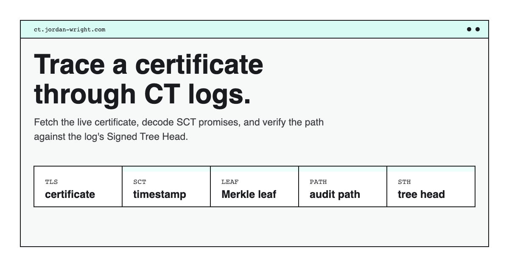

# Certificate Transparency Proof Explorer

A microsite for tracing a live HTTPS certificate into Certificate Transparency logs.

<p align="center">
  
</p>

The project is meant to be both a debugging tool and a learning tool. Enter a website, fetch its live certificate, inspect the Signed Certificate Timestamps (SCTs), ask the relevant CT log for an inclusion proof, and replay the Merkle audit path in the browser until it reaches the signed tree head root.

## Attribution

This project was coded entirely by Claude as an experiment to better understand how certificate transparency (CT) works.

## What It Shows

- The certificate chain returned by the target website.
- Normal TLS validation results, including hostname and chain checks.
- Embedded and TLS-delivered SCTs.
- The CT log that issued each SCT, using Chrome's public log list.
- The Merkle leaf hash used for the proof.
- The signed tree head root returned by the log.
- Every audit-path sibling hash.
- Every parent hash computed on the way from the certificate leaf to the tree root.

The important idea is that the log does not prove "this domain is good." It proves that a specific Merkle tree leaf appears in a specific tree snapshot. The browser-facing UI makes that boundary visible.

## How It Works

For a target like `https://jordan-wright.com`, the backend:

1. Opens a TLS connection to the target host.
2. Reads the leaf certificate and chain.
3. Parses SCTs from the certificate and TLS handshake.
4. Looks up SCT log IDs in Chrome's CT log list.
5. Rebuilds the CT Merkle leaf for the SCT.
6. Fetches the log's signed tree head.
7. Requests an inclusion proof for the leaf hash at that tree size.
8. Replays the audit path locally.
9. Returns a proof transcript for the frontend to visualize.

The backend uses Google's `certificate-transparency-go` library for CT protocol details like SCT parsing, Merkle leaf construction, log-list parsing, and CT log API clients. The local code focuses on the educational transcript: showing exactly how the audit path hashes combine into the signed root.

## Local Development

```sh
go run ./cmd/server
```

Open:

```text
http://localhost:8080
```

Run tests:

```sh
go test ./...
```

## API

The local server and Lambda entrypoint expose the same API shape:

```text
GET /api/analyze?url=https://example.com
```

The response includes certificate metadata, validation status, SCT details, CT log metadata, inclusion proof data, and the full audit-path hash transcript.

## Deployment

The frontend is static HTML, CSS, and JavaScript, so it can be hosted on Cloudflare Pages, S3/CloudFront, Netlify, or any static host.

The backend is Go and can run as:

- the local development server in `cmd/server`
- an AWS Lambda Function URL via `cmd/lambda`
- a small Go service or container on another platform

Build a Linux ARM64 Lambda binary:

```sh
GOOS=linux GOARCH=arm64 go build -o bootstrap ./cmd/lambda
zip function.zip bootstrap
```

Use AWS Lambda's `provided.al2023` runtime with ARM64 architecture, upload `function.zip`, and enable a Function URL.

## Network Safety

The service fetches user-supplied HTTPS hosts, so the backend includes guardrails for outbound requests. It accepts only HTTPS targets, rejects localhost-style names, resolves hostnames before dialing, and blocks private, loopback, link-local, multicast, documentation, carrier-grade NAT, and other reserved IP ranges before TCP connect.

These checks are intentionally small and standard-library based. They are meant to keep the app deployable without requiring a forward proxy, while still avoiding the most obvious SSRF footguns.
